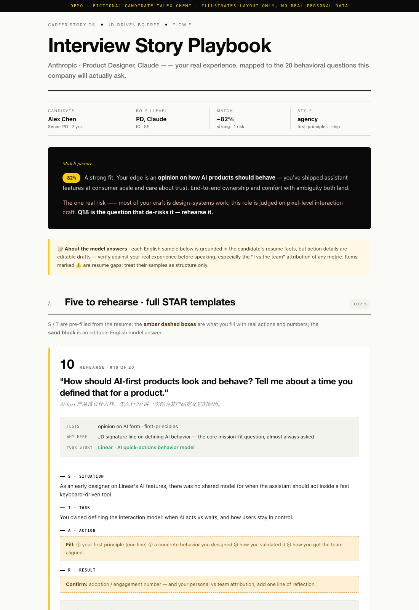

# BQ Skill

> 🌐 **中文** · [English](./README.md)
>
> 📦 也可以从 **[offer-toolkit-skill](https://github.com/yanliudesign/offer-toolkit-skill)** 一站式获取（JD · Resume · BQ 三合一）。

一个 Claude skill，专门做行为面试准备。不是给你现成答案，而是帮你把过去真实做过的事情挖出来、整理成一个可以反复用的故事库。它会一步步追问你的经历，用 STAR/CAR 帮你理清思路，打上"拿主意""处理模糊性"这类标签，中英文各存一份——下次碰上不一样的行为面试题，同一个故事还能接得住。


<sub>「JD 驱动准备」产出：对着 JD 反推的 Top 20 选题，带 STAR 模板和可改写的范例答案。<i>（Demo 用虚构候选人，无真实个人数据。）</i></sub>

## 目录
```
bq-skill/
├── SKILL.md                      # 入口：意图路由 + 五条流程
├── prompts/
│   ├── story-mining.md           # ★ 四层追问引擎（「挖新故事」）
│   ├── structuring.md            # 诊断+改写已有答案（「打磨已有故事」）
│   └── jd-driven-prep.md         # ★ JD×简历 → Top 20 选题 + STAR 模板（「JD 驱动准备」）
├── frameworks/
│   ├── star-car.md               # STAR/CAR/SOAR 选择 + 一稿多用
│   ├── competency-tags.md        # 能力标签词典 + BQ 题型反查
│   └── company-profiles.md       # Amazon LP / Meta / Anthropic / OpenAI 风格
├── assets/
│   └── bq-prep-report.md         # 「JD 驱动准备」 的 editorial HTML 报告规范
└── story-bank/                    # 用户资产，每个故事一个 .md
    ├── _index.md                 # 能力标签 → 故事 反查表
    ├── _story-template.md        # 故事模板
    └── convince-team-rewrite.md  # 示例故事（可删）
```

## 与 job-description-skill 挂钩
「JD 驱动准备」直接复用 [job-description-skill](https://github.com/yanliudesign/job-description-skill) 解码出的
Must Have + Hidden Signals，针对某个具体岗位反推 **Top 20 BQ 选题**，用你简历里的真实经历
为每题搭 STAR 准备模板，输出一份 HTML 报告。

## 用法
对 Claude 说"帮我准备 behavioral 面试""帮我挖一个故事建库""贴一道 BQ 帮我答"，或直接 `/bq-skill`。

## 打造自己的版本
`prompts/story-mining.md` 的追问话术、`frameworks/competency-tags.md` 的标签词典，
是最该按你自己经验去改的地方——你越往里喂自己的话术和标签，这个 skill 就越像你。

## 配套 skill
- [offer-toolkit-skill](https://github.com/yanliudesign/offer-toolkit-skill) — 三件套（JD · Resume · BQ）
- [job-description-skill](https://github.com/yanliudesign/job-description-skill) — JD 解码 + Offer 策略
- [resume-builder-skill](https://github.com/yanliudesign/resume-builder-skill) — 简历生成与美化
